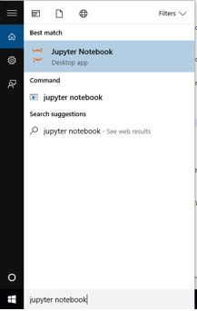
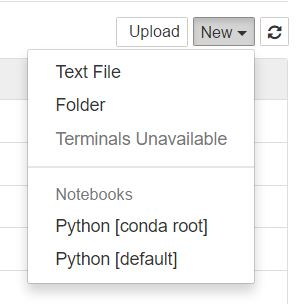

# Python2.7 Course 2018

This course will help you to understand the syntax of python, the common errors and writing good code.

### Prerequisites

All you need is a good internet and you need to download the sources from the links below and have python up and running in your system

### Get Started

1 - In order to get the most out of this course you need to have anaconda and jupyter notebook installed in your system and well configured

```
download anaconda from the links list below and install it
```

2 - download the repository as zip, then unzip it after that you will find the files ending with .ipynb 

3 - run jupyter notebook from the anaconda list



```
until finished
```

4 - after you run it, jupyter notebook will open in the browser then you click new create new folder give it any name



5 - then click that folder and open it, after that click the upload button

6 - locate the .ipynb file to have it in your control, then you are ready to good

## Links

* [python](https://www.python.org/) - Python Programming Language
* [anaconda](https://www.anaconda.com/download/) - Contains jupyter notebook which is a nice tool for learning
* [jupyter notebook how to use](https://jupyter-notebook-beginner-guide.readthedocs.io/en/latest/) - How to use jupyter notebook

## Acknowledgments

* Great thanks to my friend Mohammed Almudather Yahya
* Great thanks to MCI
